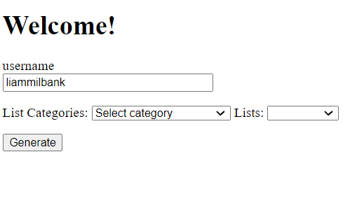
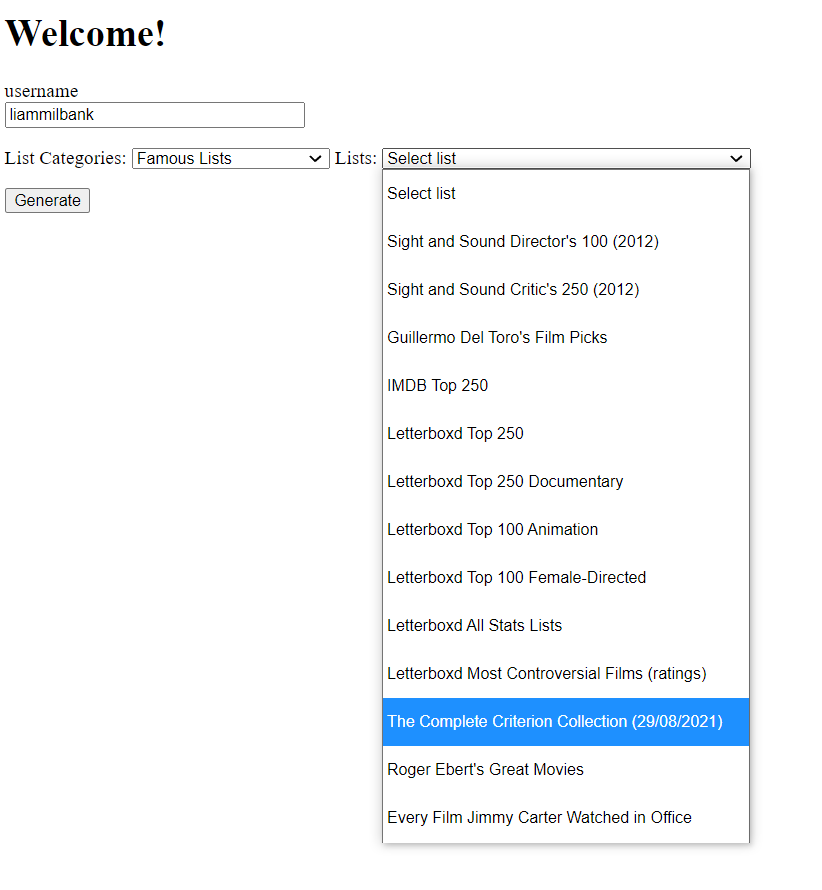
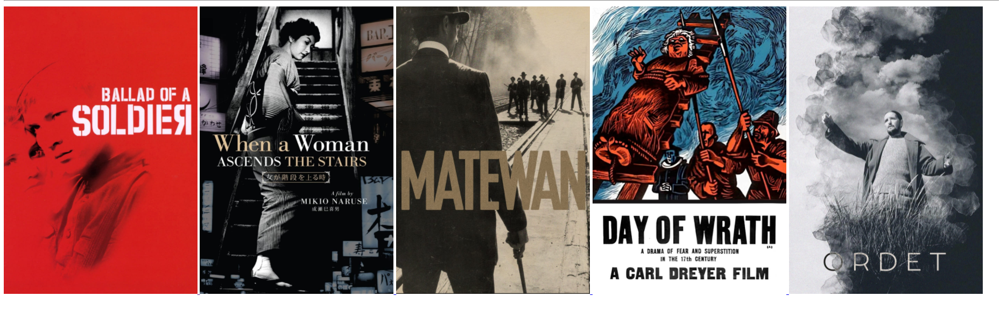

<h3 align="center">Watch the Right Thing</h3>

  

    Finding people the right movies using their own taste
  

<!-- ABOUT THE PROJECT -->
## About The Project

This project allows a user to get movie reccomendations based on their previous ratings on the film website Letterboxd.com. A user provides their username and a classification tree model predicting user rating is fit to their data, they can then select a list from a range of different lists based on genres and other potential criteria for the films. Five recommendations are given that have the highest predicted ratings whilst remaining diverse to allow for certain films being generally right but not right for the precise instanc they wish to view the film in. There is currently a simple flask web interface that allows access.

(<a href="#top">back to top</a>)

### Built With

* [Python](https://www.python.org/)
* [R](https://www.r-project.org/)
* [Rpy2](https://rpy2.github.io/doc/latest/html/index.html)
* [TMDBApi](https://developers.themoviedb.org/3/)

(<a href="#top">back to top</a>)

<!-- USAGE EXAMPLES -->
## Usage

Firstly the user enters their username

They then select a list from the dropdowns

After pressing generate this is returned, each poster is clickable with the link going to the associated letterboxd page for the film.

(<a href="#top">back to top</a>)

<!-- ROADMAP -->
## Roadmap

- [] Enchanced Web Interface
    - [] Access to view user model
    - [] Aesthetically pleasing design
- [] Compound Models
    - [] Implement simple additive joining of multiple users models
    - [] Implement 

(<a href="#top">back to top</a>)

<!-- ACKNOWLEDGMENTS -->
## Acknowledgments

* Ivan Velickovic - For his help across the whole project in particular speeding things up
* Sam Learner - His scraping functions for Letterboxd were used as the basis for mine (https://github.com/sdl60660/letterboxd_recommendations)

(<a href="#top">back to top</a>)

